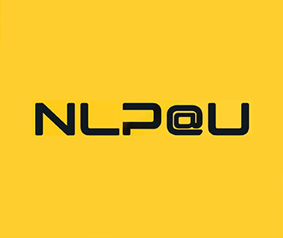

# NLP@U

NLP@U is a Special Interest Group of the Applied Data Science focus area of Utrecht University.

## Have news?
If you'd like to share your work or other interesting news through a news post on the website, you can create a [pull request](https://github.com/NLP-U/NLP-U.github.io/pulls). Start with a new branch for your news post and make your changes locally. You can use the `template.md` or any of the existing posts in `_posts` to format your post. Once you're done, create a pull request and wait for feedback or approval by one of the maintainers. Once approved, it will be posted automatically for you. If you are unfamiliar with GitHub, you can also create a [post request](https://github.com/NLP-U/NLP-U.github.io/issues/new/choose) to have one of the maintainers create the news post for you.

## Contact
If you have any other questions or requests, please don't hesitate to contact us through [GitHub issues](https://github.com/NLP-U/NLP-U.github.io/issues/new/choose). 